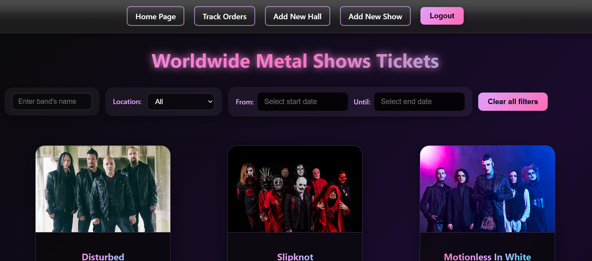

# 🎸 Metal Shows

## Overview

Metal Shows is a Full-Stack web application for managing and booking metal concerts. The project includes a React frontend and a Spring Boot backend with JPA and database integration (MySQL). It allows users to view upcoming shows, reserve tickets, manage halls and seating, and provides an admin panel to add or update shows.



## Features

- 🎶 **Browse Shows** – View upcoming metal shows
- 🎫 **Reserve Tickets** – Book tickets online
- 🏟 **Hall Management** – Manage halls and seating layouts
- 👩‍💻 **Admin Panel** – Create and update shows

## Technologies

- **Frontend**: React, React Router, CSS
- **Backend**: Spring Boot, REST API, JPA
- **Database**: MySQL
- **Deployment**: GitHub Pages (Frontend)

## Installation

### Prerequisites

Make sure you have the following installed:
- Java 17+
- Node.js and npm
- MySQL

### Setup Instructions

1. Clone the repository:
   ```bash
   git clone https://github.com/Gavri8827/Metal-Shows.git
   cd Metal-Shows
   ```

2. Configure the database:
   - Update the `application.properties` file with your MySQL database configuration
   - Location: `backend/src/main/resources/application.properties`

3. Run the Backend (Spring Boot):
   - Navigate to: `backend/src/main/java/com/.../BackendMetalShowsApplication`
   - Run the application
   - The API will be available at: http://localhost:8081/api

4. Run the Frontend (React):
   ```bash
   cd frontend
   npm install
   npm start
   ```
   - The app will be available at: http://localhost:3000

## Usage

Once both servers are running:
- **Frontend**: [http://localhost:3000](http://localhost:3000)
- **Backend API**: [http://localhost:8081/api](http://localhost:8081/api)

Users can browse shows, reserve tickets, and admins can manage the concert listings through the admin panel.

## Project Structure

```
Metal-Shows/
├── backend/                 # Spring Boot backend
│   └── src/main/java/      # Java source files
│       └── ...             # BackendMetalShowsApplication
└── frontend/               # React frontend
    ├── src/                # React components
    └── public/             # Static assets
```

## Author

[Gavri8827](https://github.com/Gavri8827)

## Contributing

Contributions, issues, and feature requests are welcome!
