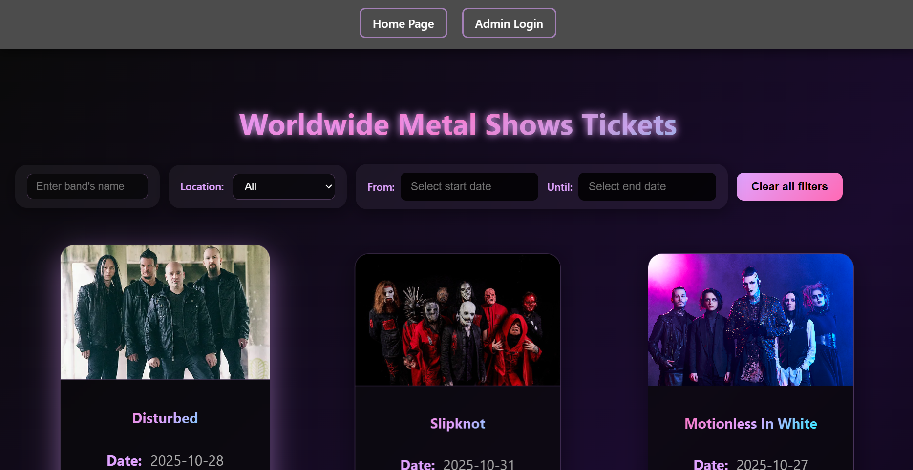

# 🎸 Metal Shows

## Overview

Metal Shows is a Full-Stack web application for managing and booking metal concerts. The project includes a React frontend and a Spring Boot backend with JPA and database integration (SQLite). It allows users to view upcoming shows, reserve tickets, manage halls and seating, and provides an admin panel to add or update shows.

You can watch the website front in the address:
https://gavri8827.github.io/Metal-Shows



## Features

- 🎶 **Browse Shows** – View upcoming metal shows
- 🎫 **Reserve Tickets** – Book tickets online
- 🏟 **Hall Management** – Manage halls and seating layouts
- 👩‍💻 **Admin Panel** – Create and update shows

## Technologies

- **Frontend**: React, React Router, CSS
- **Backend**: Spring Boot, REST API, JPA, Maven
- **Database**: SQLite,MySql
- **IDE**: Visual Studio Code
- **Deployment**: GitHub Pages (Frontend)

## Installation

### Prerequisites

Make sure you have the following installed:
- Java 21
- Node.js >= 16 and npm
- Maven
- Visual Studio Code

### Environment Variables Setup

To ensure the system works properly with Maven:

1. **JAVA_HOME** – Must point to your Java 21 installation directory
   - Example (Windows):
     ```
     JAVA_HOME=C:\Program Files\Java\jdk-21
     ```

2. **PATH** – Must include Java's bin directory and Maven
   - Example:
     ```
     PATH=%JAVA_HOME%\bin;C:\apache-maven-3.10.1\bin;%PATH%
     ```

3. **Verify your setup** – Run these commands in terminal:
   ```bash
   java -version   # Should show Java 21
   mvn -v          # Should show Maven version
   ```

💡 **Tip**: Restart your terminal/PowerShell/Command Prompt after changing environment variables.

### Setup Instructions

1. **Clone the repository:**
   ```bash
   git clone https://github.com/Gavri8827/Metal-Shows.git
   cd Metal-Shows
   ```

2. **Run the Backend (Spring Boot + Maven):**
   ```bash
   cd backend
   mvn clean install
   mvn spring-boot:run
   ```
   - The API will be available at: http://localhost:8081/api

3. **Run the Frontend (React):**
   ```bash
   cd ../frontend
   npm install
   npm start
   ```
   - The app will be available at: http://localhost:3000

## Usage

Once both servers are running:
- **Frontend**: [http://localhost:3000](http://localhost:3000)
- **Backend API**: [http://localhost:8081/api](http://localhost:8081/api)

**Regular Users**: Browse shows and reserve tickets.

**Admins**: Access the Admin panel to manage shows, halls, and reservations.

## Project Structure

```
Metal-Shows/
├── backend/                 # Spring Boot backend
│   └── src/main/java/      # Java source files
│       └── ...             # BackendMetalShowsApplication
└── frontend/               # React frontend
    ├── src/                # React components
    └── public/             # Static assets
```

## Contributing

Contributions, issues, and feature requests are welcome!
